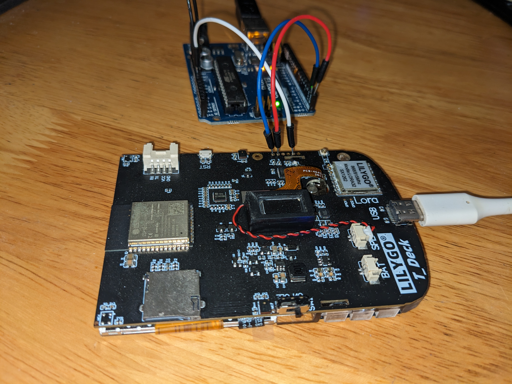
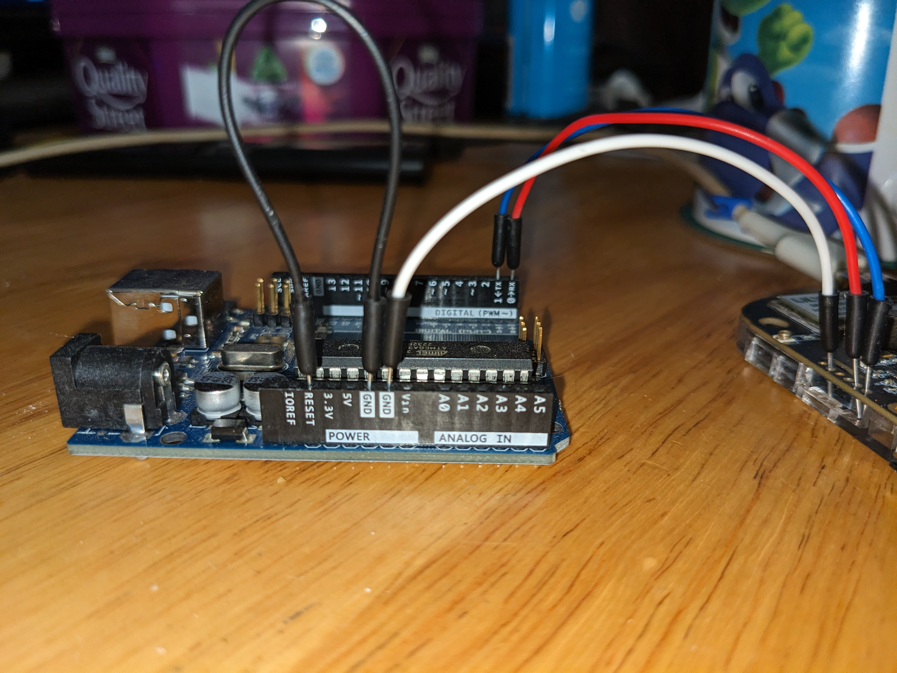

# Usage

The T-Deck contains an ESP32C3 configured as an I2C slave to read the keyboard inputs. It's accessed using the 6 pin connector holes below the reset button. The controller can be programmed using the Arduino IDE, VS Code, etc.

## Hardware Setup
There are many ways to program this controller, you can use something like the [FTDI TTL-232R-3V3 USB To Serial Cable](https://ftdichip.com/products/ttl-232r-3v3/) or an Arduino Uno. Connect the pins as shown in either of the methods below. To put the ESP32C3 into programming mode, short the BOOT pin to ground and power it on. 

> - the header doesnt use standard breadboard spaced holes so you might want to use wires.
> - the ESP32C3 controller has to be turned on by pin 10 in the main ESP32S3 sketch, so make sure the T-Deck's firmware does that (the provided test firmware does).

### Method 1: Using An Arduino Uno

- GND on the Ardunio Uno to GND on the Arduino, this is required for the serial communication to work.
- TX to TX (T-Deck >>> Arduino Uno), 
- RX to RX (T-Deck >>> Arduino Uno), 
- GND to GND (T-Deck >>> Arduino Uno),
- Short the T-Deck's BOOT pin to the T-Decks GND pin to put the ESP32C3 into programming mode.




### Method 2: Using A FTDI Cable

- TX to RX (T-Deck >>> Arduino Uno),
- RX to TX (T-Deck >>> Arduino Uno),
- GND to GND (T-Deck >>> Arduino Uno),
- Short the T-Deck's BOOT pin to the T-Decks GND pin to put the ESP32C3 into programming mode.

```
t-deck    |
         |=|  rst button       ftdi cable
          |                ____________
          |               | RTS         Green
        o | TX  ----------| RX          Yellow
        o | RX  ----------| TX          Orange
        o | BOOT----|     | VCC         Red
        o | RST     |     | CTS         Brown
        o | GND ----o-----| GND         Black
        o | VCC           |_____________
          |             
-|       /
_|______/

```

## Software Settings

The Arduino IDE configuration in the tools menu:

 - Board -> ESP32C3 Dev Module
 - USB CDC On Boot -> disabled
 - CPU Frequency -> 40MHz
 - USB DFU On Boot -> Disable
 - Flash Mode -> DIO 40MHz
 - Flash Size -> 4MB(32Mb)
 - Partition Scheme -> Default 4Mb with spifs
 - Upload Speed -> 921600

Select the COM/SERIAL port of the USB to serial cable. Once the controller is in programming mode (it'll print a message over the UART saying "waiting for download" when powered up with the BL pin shorted to ground) press download on the Arduino IDE and it should upload the firmware. Restart the device afterwards.